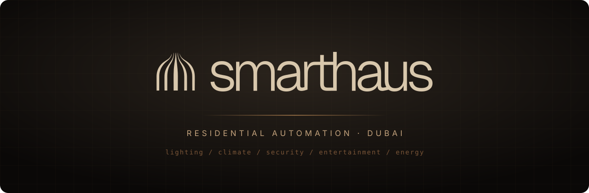
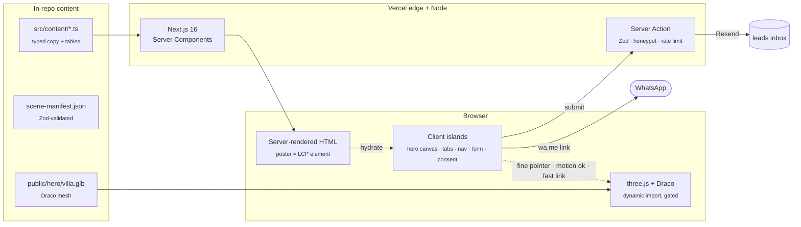

<p align="center">
  
</p>

<p align="center">
  <a href="https://smarthaus-livid.vercel.app"></a>
  
  
  
  
  
  
</p>

<p align="center">
  <b>The marketing site for Smarthaus</b>, the home automation brand of Maple Technologies.<br>
  Every page ends at one conversion: a conversation.
</p>

<p align="center">
  <a href="#-quickstart">Quickstart</a> ·
  <a href="#-architecture">Architecture</a> ·
  <a href="#-the-hero">The hero</a> ·
  <a href="#-quality-gates">Quality gates</a> ·
  <a href="#-commands">Commands</a> ·
  <a href="#-where-the-rules-live">Rules</a>
</p>

---

## ◆ At a glance

```text
 ┌──────────────────────────────────────────────────────────────────────┐
 │  SMARTHAUS / smarthaus.ae                                            │
 ├──────────────────────────────────────────────────────────────────────┤
 │  kind        marketing site: no app, no dashboard, no e-commerce     │
 │  rendering   Server Components first, a short list of client islands │
 │  hero        real-time three.js villa over a server-rendered poster  │
 │  motion      CSS + IntersectionObserver + Web Animations API         │
 │  leads       Server Action → Zod → honeypot → rate limit → Resend    │
 │  analytics   Vercel Analytics + Speed Insights, cookieless           │
 │  runtime     8 production dependencies, total                        │
 │  host        Vercel, production from main, preview per PR            │
 └──────────────────────────────────────────────────────────────────────┘
```

It is built for four readers, and none of them respond to hype: an existing Maple client who wants the spec, a couple comparing five vendors who fear the one that disappears, an investor who wants numbers, and an interior designer who needs something she can hand to her own client. The code is held to the same standard as the copy: precise, restrained, verifiable.

---

## ⚡ Quickstart

> Requires **Node 22** and **pnpm 12** (pinned in `packageManager`).

```bash
git clone --recurse-submodules https://github.com/Qera-Studio/smarthaus.git
cd smarthaus
pnpm install
cp .env.example .env.local   # fill in the values below
pnpm dev                     # http://localhost:3000
```

Cloned without submodules? `git submodule update --init` pulls in `qera-system/`.

<details>
<summary><b>Environment variables</b></summary>
<br>

| Variable                      | Scope  | Purpose                                                |
| ----------------------------- | ------ | ------------------------------------------------------ |
| `NEXT_PUBLIC_SITE_URL`        | public | Canonical origin for metadata, OG and the sitemap      |
| `NEXT_PUBLIC_WHATSAPP_NUMBER` | public | Target of the `wa.me` deep links                       |
| `RESEND_API_KEY`              | server | Sends lead emails                                      |
| `LEAD_EMAIL`                  | server | The mailbox that receives leads (the system of record) |
| `LEAD_FROM_EMAIL`             | server | Sender address, on a domain verified in Resend         |
| `SANITY_*`                    | server | Reserved for the CMS, not wired yet                    |

`VERCEL`, `VERCEL_ENV` and `VERCEL_URL` are injected by the platform. Analytics mount only when `VERCEL` is set, because their scripts are served by Vercel, not by this app.

</details>

---

## 🏛 Architecture



**The shape of the thing:**

- **Server first.** Every page is a Server Component. `'use client'` is a short, named list in [`CLAUDE.md`](CLAUDE.md#client-components--the-short-list), and each entry earns its place.
- **No database.** A lead is an email. When a CRM exists, that changes. Not before.
- **No third party on first load.** No pixel, no chat widget, no tag manager. GA4 and Clarity are planned, and the consent gate (`src/components/Consent/`) ships ahead of them on purpose.
- **CSP is `default-src 'self'`.** The only widening is `'wasm-unsafe-eval'` plus `worker-src blob:` for a **self-hosted** Draco decoder, with its reasoning inline in [`next.config.ts`](next.config.ts). A stricter report-only twin, without `'unsafe-inline'`, runs alongside it, and both report violations to `/api/csp-report`.

---

## 🎬 The hero

The homepage opens on a villa you can move around. It is also a single image.

```text
   first paint                      after hydration (only if the device qualifies)
 ┌────────────────────┐            ┌────────────────────┐
 │                    │            │    ╱╲  ← orbit      │
 │    poster     │  ──fade──▶ │   three.js canvas  │   az ±4°, el 0–5°
 │   fetchpriority    │            │   villa.glb (Draco)│   one-sided: never
 │   = LCP            │            │                    │   looks up from ground
 └────────────────────┘            └────────────────────┘
          ▲
          └── stays forever on: touch · reduced motion · Save-Data · 2g/3g · any WebGL failure
                               (and on those devices, zero bytes of three.js are fetched)
```

Why real-time and not pre-rendered: the 45-frame cursor grid it replaced cross-faded between camera angles, and a cross-fade between two viewpoints is a double exposure. The measured scene is ~30k triangles, zero textures, zero lights, so the "10MB WebGL bundle" objection did not apply. The full decision, and the conditions it rests on, are in [`AGENTS.md`](AGENTS.md#threejs--the-ban-and-why-it-was-lifted-for-the-hero-only).

<details>
<summary><b>Media pipeline</b></summary>
<br>

```text
 villa.blend ──▶ scripts/export-villa.py ──▶ public/hero/villa.glb   (Draco)
 renders     ──▶ ffmpeg                  ──▶ AV1 primary  + H.264 fallback
 stills      ──▶ sharp                   ──▶ AVIF primary + WebP  fallback
```

Mobile gets its own portrait compositions, never a CSS crop of desktop. Phases 2 and 3 (the approach clip and the isometric explorer) are specced against `src/content/scene-manifest.json`, whose schema lives in `src/lib/manifest.ts`.

</details>

<details>
<summary><b>The Process rail</b></summary>
<br>

A brown-950 stage grows out of the page, pins, then scrolls sideways, all from vertical scroll and all in CSS: a tall spacer with a `view-timeline`, a sticky pin, a track driven by `animation-timeline`. Browsers without scroll timelines get a 40-line rAF fallback that writes exactly one custom property and deletes itself the day Firefox ships the feature. Reduced motion collapses it to a plain `overflow-x` list. Details in [`AGENTS.md`](AGENTS.md#the-process-rail--horizontal-scroll).

</details>

---

## 🛡 Quality gates

Nothing merges into `latest` or `main` on trust. Every check below is a required status in CI, enforced by the `protect latest and main` ruleset.

| Job                    | What it proves                                                                              |
| ---------------------- | ------------------------------------------------------------------------------------------- |
| `static`               | ESLint, `tsc`, a production build, and the cascade layer order in **every** built CSS chunk |
| `unit`                 | Jest + RTL with coverage, the coverage gate, and the 1:3 test-ratio gate                    |
| `e2e (Desktop Chrome)` | Playwright + axe on every route                                                             |
| `e2e (iPhone 17)`      | Same suite, WebKit, 402 px mobile viewport                                                  |
| `e2e (Galaxy S24)`     | Same suite, Chromium, 360 px narrow Android viewport                                        |
| `e2e-extra`            | `forced-colors` and 200% zoom projects                                                      |
| `lighthouse`           | Lighthouse CI against the production build                                                  |

One more job runs on every PR but is deliberately not required: `delivery` sends one real email through Resend, so a broken key, domain or quota shows up without blocking code that did not cause it.

**Lighthouse thresholds** (median of three runs, from [`lighthouserc.json`](lighthouserc.json)):

```text
 performance     ≥ 0.95        LCP   ≤ 2.5 s
 accessibility   = 1.00        TBT   ≤ 200 ms
 best practices  ≥ 0.95        CLS   ≤ 0.05     ← tighter than CWV's 0.1, on purpose
 seo             = 1.00        JS    ≤ 640 KB   uncompressed first load
```

**Test discipline.** Every line of code carries three lines of test. Until the tree reaches 3:1, each PR must meet 3:1 on its own diff and must not lower the overall ratio. Every line a PR adds or changes must run in a unit test, with at least 90% of the branches on those lines taken, and global line coverage may only go up. Unit tests fail on any `console.error`/`warn`, and on any CSS Module key that does not exist. A failing test is reported, never retried, skipped or softened.

> [!NOTE]
> Honest status: the tree is still below 3 : 1 and ratcheting up (it started at 0.44 : 1). `pnpm test:ratio` prints the current figure and the shortfall.

Locally, Husky runs lint, Prettier and `tsc` on commit, and the full unit suite plus both gates on push.

---

## 🧰 Commands

| Command               | Does                                                             |
| --------------------- | ---------------------------------------------------------------- |
| `pnpm dev`            | Dev server (Turbopack)                                           |
| `pnpm build`          | Production build                                                 |
| `pnpm start`          | Serve the production build                                       |
| `pnpm lint`           | `eslint .` (`next lint` no longer exists in Next 16)             |
| `pnpm typecheck`      | `tsc --noEmit`                                                   |
| `pnpm test`           | Jest unit suite                                                  |
| `pnpm test:coverage`  | Jest with coverage                                               |
| `pnpm test:e2e`       | Playwright across all device projects                            |
| `pnpm test:lhci`      | Lighthouse CI against a local production build                   |
| `pnpm test:ratio`     | Measure the code-to-test line ratio                              |
| `pnpm coverage:gate`  | Check coverage against the baseline and touched files            |
| `pnpm coverage:raise` | Raise `coverage-baseline.json` after adding tests (only goes up) |
| `pnpm analyze`        | Bundle analyzer                                                  |

> [!IMPORTANT]
> E2E form tests do not send email. Under Playwright the server writes each lead email to `.e2e-mail/`, and the tests read it back to check its content, consent record included. One test per CI run, in the `delivery` job, sends a real email through Resend.

---

## 🗺 Project layout

```text
smarthaus/
├── src/
│   ├── app/              routes · metadata · robots · sitemap · the contact Server Action
│   ├── components/       one folder per component, each with its module.scss and __tests__
│   ├── content/          typed copy, pricing, FAQ, legal text, the scene manifest
│   ├── lib/              Zod schemas, consent record, manifest loader
│   └── styles/           tokens, reset, cascade layers
├── public/
│   ├── hero/             villa.glb, stills, process and hardware imagery
│   ├── draco/            self-hosted decoder (the reason the CSP allows wasm)
│   └── brand/            logo lockups, all currentColor SVG
├── e2e/                  Playwright specs, one per surface
├── scripts/              ratio + coverage gates, layer-order assert, media pipeline
├── qera-system/          ⟵ submodule: the standards this repo answers to (read-only here)
├── AGENTS.md             engineering rules: how
└── CLAUDE.md             project orientation: who, what, why
```

**Routes.** Live: `/`, `/contact`, `/pricing`, `/faq`, `/privacy`, `/terms`, `/cookie-preferences`, and a `/404` with a particle-text canvas. Placeholders until their content is confirmed: `/solutions`, `/about`, `/designers`, `/developers`.

---

## 📐 Where the rules live

This repo answers to [`qera-system/`](qera-system/), nine documents with a fixed precedence:

```text
 1 Legal  ▸  2 Security  ▸  3 Accessibility  ▸  4 Engineering  ▸  5 Performance  ▸  6 SEO  ▸  7 Design
```

When two rules disagree, the lower number wins. Before writing any threshold into this repo, check `qera-system/charter/owned-facts-register.md`: if another document owns the number, point to it, don't copy it.

| Read                     | For                                                                                  |
| ------------------------ | ------------------------------------------------------------------------------------ |
| [`CLAUDE.md`](CLAUDE.md) | Who Smarthaus is, the four personas, tone, visual direction, the client-island list  |
| [`AGENTS.md`](AGENTS.md) | Hero spec, media pipeline, SCSS rules, CSP, forms, dependency policy, testing policy |

**Five rules that surprise people:**

1. **No GSAP, Framer Motion, Lenis, or React Three Fiber.** three.js is allowed in exactly one component.
2. **Logical properties only.** `padding-inline`, never `padding-left`. Arabic is V2, and RTL should cost an afternoon, not a rewrite.
3. **No `var()` inside CSS shorthands.** One missing token silently kills the whole declaration.
4. **No claim without a source.** No invented heritage, no unconfirmed partner logos, no founding year until there is one.
5. **No stock photos of smart homes.** Renders, typography and space carry the design.

---

## 🌿 Workflow

```text
 feature/*  ──PR──▶  latest  ──PR──▶  main  ──▶  Vercel production
                       ▲                ▲
                  all CI checks    all CI checks
```

Commits are imperative, lowercase, and explain **why**. One concern per branch, one concern per PR.

<br>

<p align="center">
  <sub>Built by <b>Qera Studio</b> for <b>Maple Technologies</b> · Dubai</sub>
</p>
